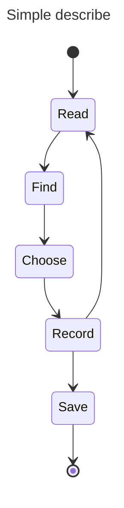

# Projct 

## open file -> (read line -> find -> numbers -> choose options -> ) [loop] -> save

```mermaid
---
title: Simple describe
---
stateDiagram-v2
    [*] --> Read
    Read --> Find
    Find --> Choose
    Choose --> Record
    Record --> Read
    Record --> Save
    Save --> [*]
```